# Trabajando con Store Procedures PL/pgSQL en PostgreSQL

Los lenguajes de procedimientos (procedural languages) han extendido la funcionalidad de las bases de datos proporcionando al lenguaje SQL cierto flujo de control similar al de un lenguaje de programación.

Cada fabricante tiene su propia implementación de un lenguaje de procedimiento basado en SQL, así Microsoft SQL Server tiene Transact-SQL, Oracle tiene PL/SQL y así sucesivamente una lista de bases de datos con su correspondiente lenguaje de procedimiento. En el caso de PostgreSQL se tienen varios lenguajes que pueden usarse como lenguajes de procedimiento entre ellos tenemos a PL/Tcl, PL/Perl, PL/Python,C y como opción predeterminada PL/pgSQL.

Las ventajas de ejecutar funciones del lado del servidor o Store Procedures con PL/pgSQL son las siguientes:

<ul>
<li><b>Extensibilidad:</b> PL/pgsql es como un lenguaje de programación incluye la asignación y evaluación de variables y la posibilidad de hacer iteraciones y cálculos más complejos que con SQL.</li>
<li><b>Seguridad:</b> Ayuda a evitar ciertos ataques con SQL Injection ya que al utilizar parámetros evita la construcción de comandos SQL utilizando la concatenación de cadenas.</li>
<li><b>Rapidez:</b> Son ejecutados más rápidamente que las consultas SQL individuales ya que después de la primera ejecución el plan de ejecución se mantiene en memoria y el código no tiene que ser analizado ni optimizado nuevamente.</li>
<li><b>Programación modular:</b> similar a los procedimientos y funciones en los lenguajes de programación, lo que evita que se tengan planas de sentencias SQL.</li>
<li><b>Reutilización:</b> de código una función puede ejecutarse dentro de distintos Store Procedures.</li>
<li><b>Rendimiento:</b> un Store Procedure puede contener decenas de sentencias SQL que son ejecutadas como una sola unidad de golpe, a diferencia de las sentencias SQL individuales donde hay que esperar a que cada una sea procesada.</li>
</ul>

Mediante los siguientes ejemplos mostraremos el uso de Store Procedures utilizando PL/pgSQL.

Creamos una base de datos de ejemplo llamada Catalogs con el siguiente comando desde el Shell.

<pre>
    $ createdb Catalogs

</pre>
<b>Fig 1. Creando la base de datos de ejemplo</b>
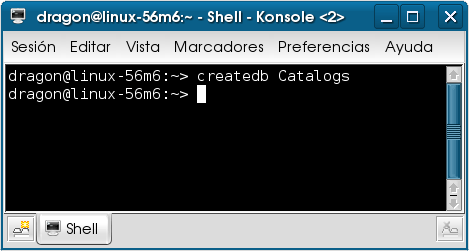

Revisamos los lenguajes de procedimiento instalados en la base de datos, revisamos que PL/pgSQL se encuentre instalado con el siguiente comando.

<pre>
    $ createlang -l Catalogs

</pre>
<b>Fig 2. Revisando la instalación del lenguaje PLSQL</b>
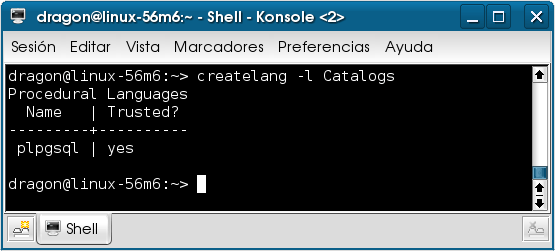

Si no se encuentra, entonces ejecutamos el siguiente comando para instalarlo, esto siempre como administrador del servidor:

<pre>
    $ createlang –U postgres plpgsql Catalogs

</pre>

Si está instalado entonces abrimos un editor de texto y creamos un archivo llamado catalogs.sql donde escribiremos los comandos para crear las tablas de ejemplo y los Store Procedures para administrar los registros de cada una de las tablas.

Para la creación de las tablas escribimos lo siguiente:
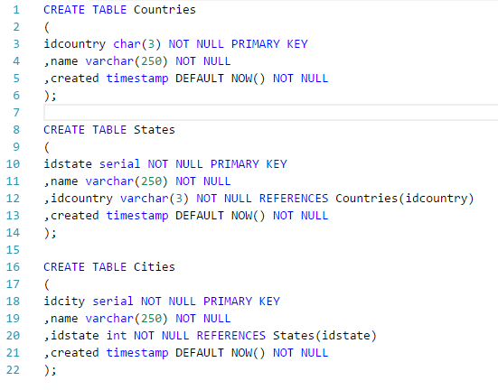

En acuerdo con la llave foránea definida en cada tabla, debe existir un país para poder crear un estado, así mismo debe de existir un estado para poder crear una ciudad, entonces creamos unos registros en la tabla países

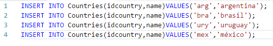
<b>Fig 3. Insertando los registros en la tabla</b>
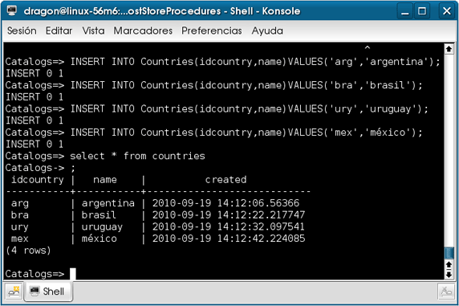

Supongamos que estas tablas van a utilizarse en un sistema donde sea obligatorio que los nombres de país, estado y ciudad, se almacenen teniendo la primera letra mayúscula o en notación Camel Case,(en este caso los países quedaron guardados con letras minúsculas de manera intencional, con el fin de mostrar un Store Procedure).

Creamos entonces una función para aplicar esta regla a los datos de la tabla countries.

La función se define con el siguiente código:

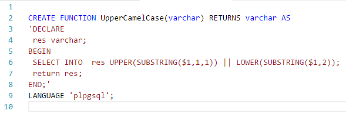

Lo aplicamos de la siguiente manera para actualizar los registros.

<b>Fig 4. Actualizando los registros utilizando la función UpperCamelCase</b>
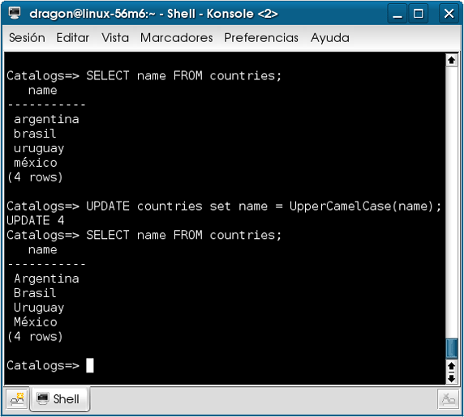

Una vez creada en el servidor se encuentra disponible para cualquier transformación que queramos aplicar sobre cualquier cadena.

<b>Fig 5. Ejecutando la función UpperCamelCase</b>
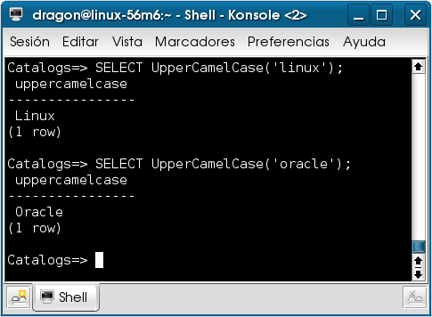

Ahora escribiremos las funciones para insertar registros en cada una de las tablas.

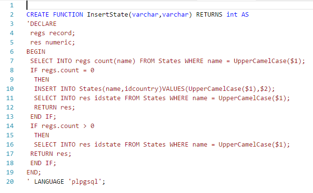

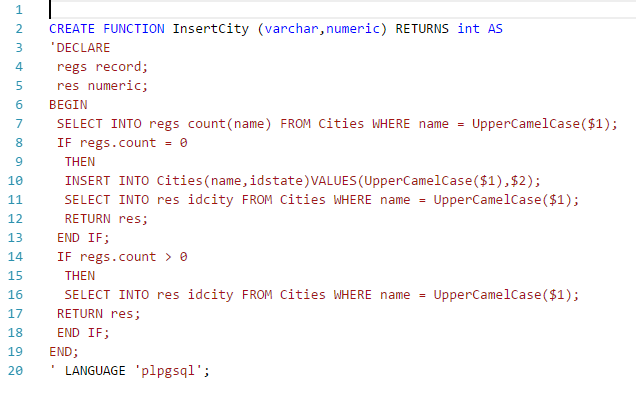

Básicamente la estructura de un Store Procedure es la siguiente:

<pre>
CREATE FUNCTION [nombre de la función] ([parámetros separados por comas]) RETURNS [el tipo de dato que regresa] AS
'DECLARE aquí se definen las variables que se usarán.
BEGIN indica el inicio de la función.
SELECT INTO este comando permite que los resultados de las consultas sean asignados a variables. 
(no debe de confundirse con SELECT [columnas] INTO)
RETURN Sale de la función y regresa el tipo de dato que se declaro después de la palabra RETURNS del CREATE FUNCTION
END indica el fin de la función
' LANGUAGE indica con que lenguaje esta escrita la función, puede ser un lenguaje de procedimiento 
(plpgsql) o de consulta (SQL).
</pre>

Vemos que en cada Store Procedure, reutiliza la función UpperCamelCase(varchar) que habíamos previamente creado.

Esto porque un Store Procedure puede llamar a otro Store Procedure que se encuentre disponible.

En las siguientes imágenes los resultados de la ejecución de cada Store Procedure.

<b>Fig 6. Ejecucción del procedimiento InsertState</b>

<b>Fig 7. Ejecucción del procedimiento InsertCity</b>
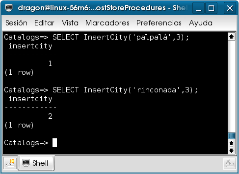
<b>Fig 8. Comprobando la aplicación de los procedimientos en los datos</b>
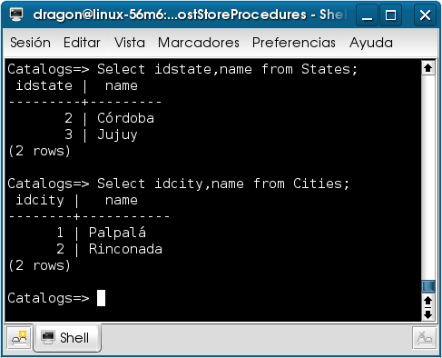